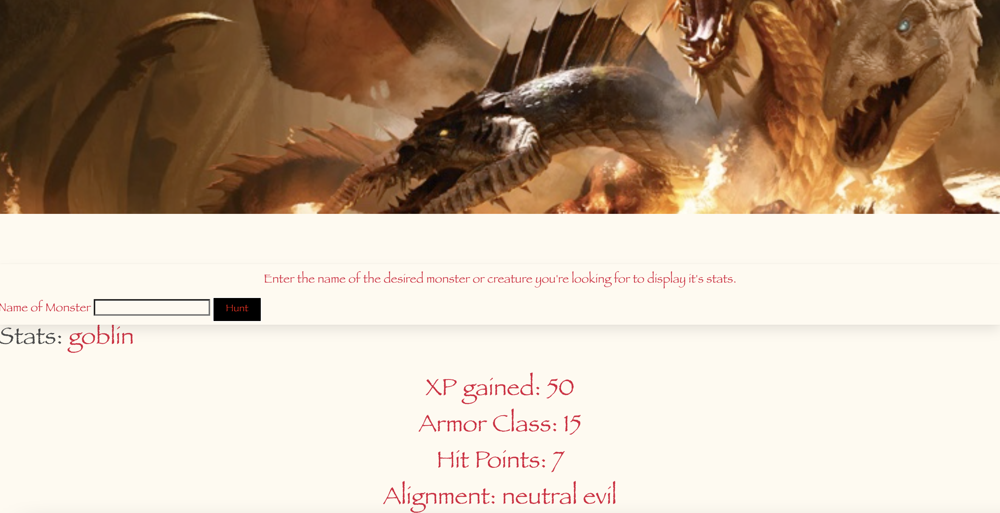

# TeamMercuryProject1

## Description

Have you ever felt LOST when playing the hit game Dungeons & Dragons and you're faced with a new TERRIFYING foe that you know nothing about? Well, have no fear! For our Monster Hunter Grimoire is here!
A brand new, cutting edge application that will instantly scour the 5th edition Dungeons & Dragons Player's Handbook for all the information you need on the beasts you are tasked in defeating.
Enter a monster's name, and be given armor class, hit points, and alignment in order to achieve victory!
The application will also aid in your journey by displaying the experience points gained upon defeating your dangerous foes, thus making you level up with haste!

## Technologies Used

Utilized open5e and dnd5e API’s to display stats and Bulma framework for styling.

## Deployed Application

https://batgal.github.io/TeamMercuryProject1/

## Screen Shot

